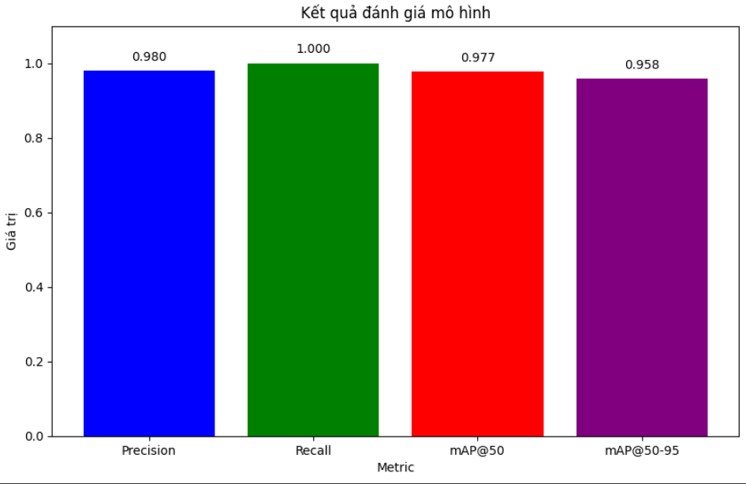

# Note: 
Project này được thực hiện như bài luyện trên lớp nên còn đơn giản và chỉ dùng cho việc tham khảo.
# PIPELINE
B1: Đưa về góc nhìn bird's eye view

B2: Detect vùng câu trả lời (chỉ lấy 1 câu) sử dụng YOLOv9.

B3: Detect số câu hỏi sử dụng YOLOv9.

B4: Xác định câu hỏi và câu được tô

- Sử dụng phương pháp đếm số pixel (có ngưỡng) để tìm câu trả lời được tô.
- Sử dụng pytessaract để đọc số câu hỏi.

# ĐÁNH GIÁ
## Mô hình 1: detect vùng câu trả lời
1. Overview
- Input: Ảnh đầu vào

- Output (lấy ví dụ 1 vùng)


2. Đánh giá

    Tập dữ liệu có cấu trúc: train:val:test = 8:1:1.
Huấn luyện Yolov9 với trọng số pre-train là yolov9c. Thực hiện đánh giá trên 51 ảnh test.


## Mô hình 2: detect câu hỏi
1. Overview
- Input (kết quả detect từ mô hình trên)

- Output:


2. Đánh giá

    Tập dữ liệu có cấu trúc: train:val:test = 8:1:1.
Huấn luyện Yolov9 với trọng số pre-train là yolov9c. Thực hiện đánh giá trên 30 ảnh test.


# Hướng dẫn thực thi chương trình
## Cài đặt môi trường
```
pip install -r requirements.txt
```

## Quick start
```
python .\extract_answer.py <image-path>
```
## Kết quả
Kết quả có dạng ```{1: 'B', 2: 'A', 3: 'A', 4: 'D',...}```

# Nhận xét:
- Mô hình 1 đạt kết quả tốt trên ảnh đầu vào.
- Mô hình 2 chưa đạt kết quả cao (mAP ngưỡng IOU 50%-95% chỉ đạt 79.2% độ chính xác)
- Hướng phát triển: tăng cường dữ liệu do mô hình 2.
